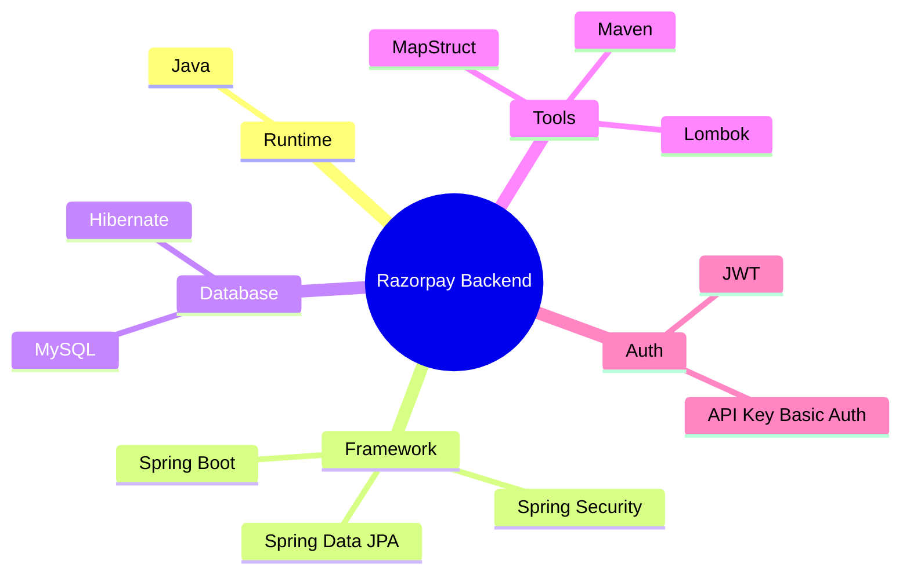
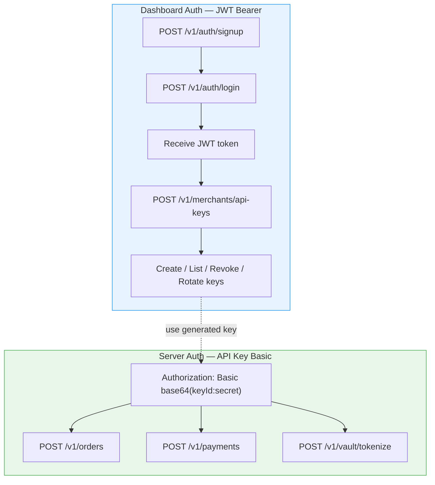
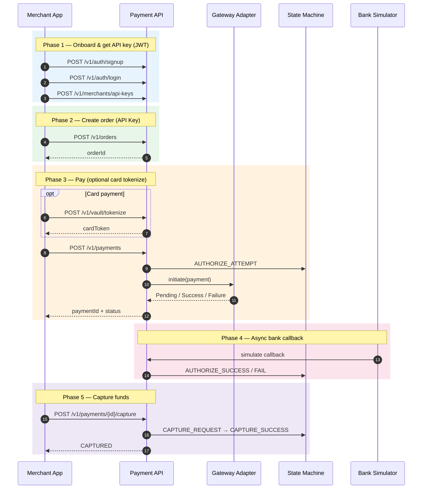
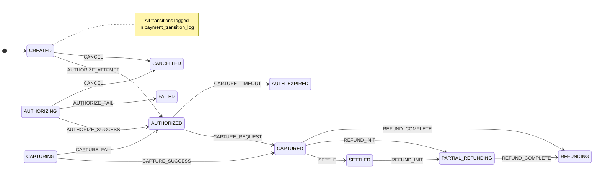
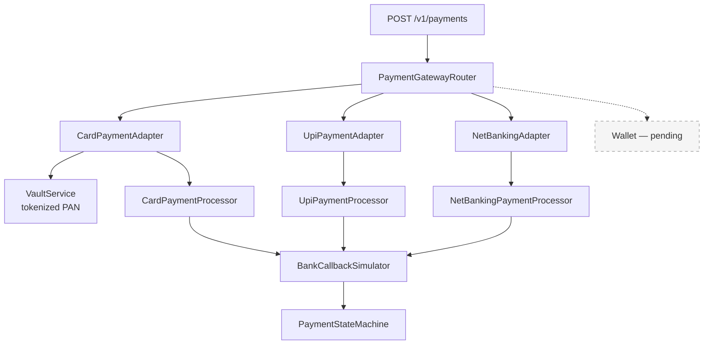
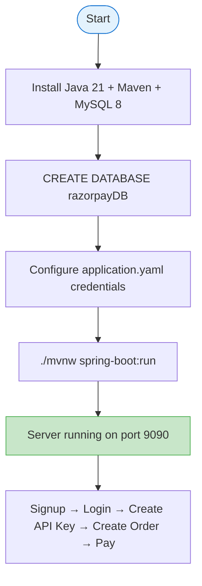

# Razorpay Payment Gateway — Backend

A Spring Boot–based payment gateway inspired by Razorpay — merchant onboarding, server-to-server payments, card vault, and bank simulation.

> **Status:** Core payment flows are live. Settlement, webhooks, and refunds are modeled but not yet exposed as APIs.

---

## Tech Stack



---

## Architecture Overview


---

## Authentication Flow



---

Base URL: `http://localhost:9090`

---

## End-to-End Payment Flow



---

## Payment State Machine



---

## Payment Method Routing


---

## Getting Started



```bash
# Quick start
./mvnw spring-boot:run

# Build
./mvnw clean package
```
