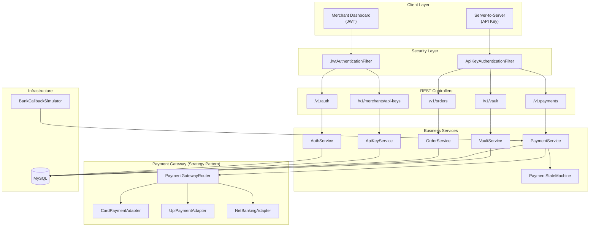
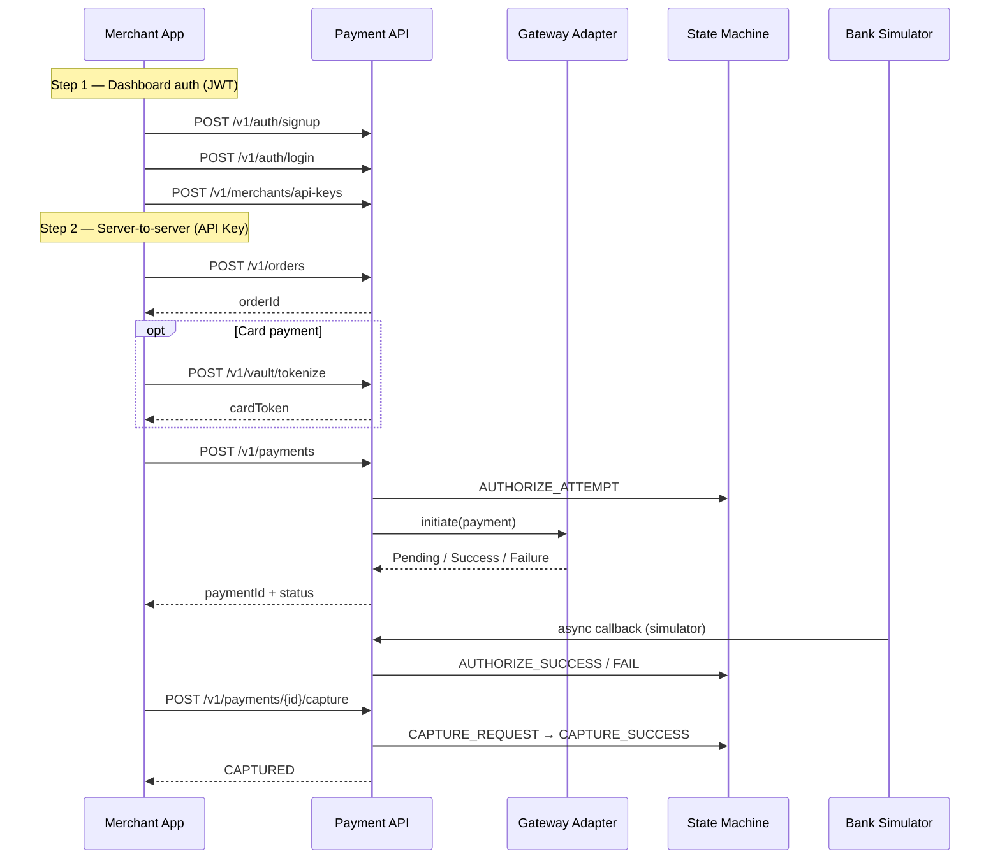
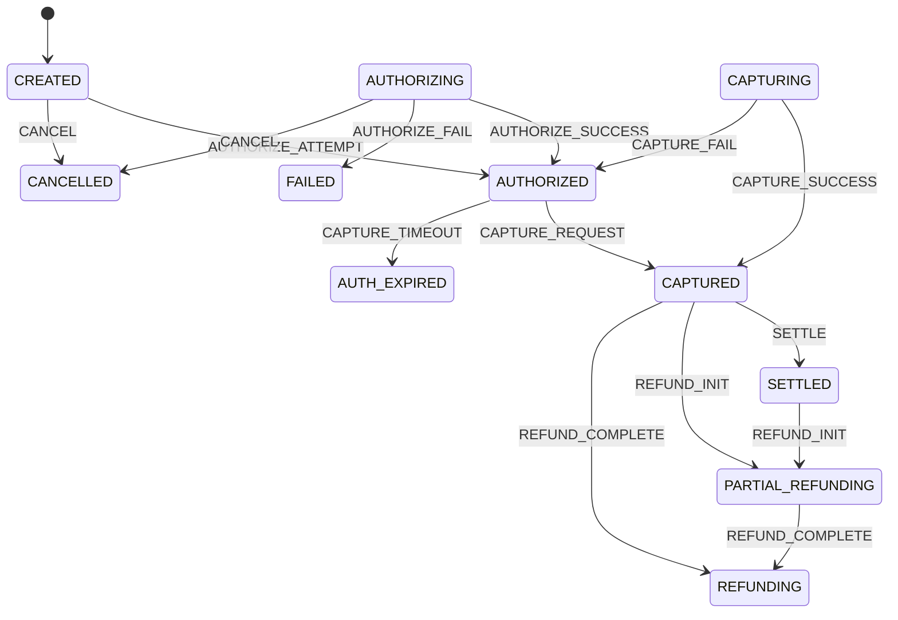

# Razorpay Payment Gateway — Backend

A Spring Boot–based payment gateway inspired by Razorpay. It supports merchant onboarding, server-to-server API access, order and payment lifecycle management, card tokenization, and simulated bank callbacks for local development.

> **Status:** Work in progress — core payment flows are implemented; settlement, webhooks, and refunds are modeled but not yet exposed as APIs.

---

## Tech Stack

| Layer | Technology |
|-------|------------|
| Runtime | Java 21 |
| Framework | Spring Boot 4.0.6 |
| Database | MySQL |
| ORM | Spring Data JPA (Hibernate) |
| Security | Spring Security + JWT + API Key (Basic Auth) |
| Mapping | MapStruct |
| Build | Maven |

---

## Project Structure

```
src/main/java/com/gayeway/Razorpay/
├── common/          # Shared enums, entities, exceptions, utilities
├── merchant/        # Signup, login, JWT auth, API key management
├── payment/         # Orders, payments, gateway adapters, state machine
├── vault/           # Card tokenization & encrypted PAN storage
├── operations/      # Settlement, webhooks, DLQ (entities designed)
└── RazorpayApplication.java
```

---

## Architecture Overview



---

## End-to-End Payment Flow



---

## Payment State Machine

Payments follow a strict state machine. Invalid transitions throw `InvalidStateTransitionException`.



Every transition is logged in `payment_transition_log` for auditability.

---

## Authentication

Two security filter chains protect different route groups:

| Route group | Auth method | Endpoints |
|-------------|-------------|-----------|
| Dashboard / admin | JWT Bearer token | `/v1/auth/**`, `/v1/merchants/**` |
| Server-to-server | API Key (HTTP Basic) | `/v1/orders/**`, `/v1/payments/**`, `/v1/vault/**` |

**JWT flow** — signup and login are public; all other merchant routes require a valid token.

**API Key flow** — send `Authorization: Basic base64(keyId:secret)` on order, payment, and vault requests.

---

## API Reference

Base URL: `http://localhost:9090`

### Auth (public)

| Method | Endpoint | Description |
|--------|----------|-------------|
| `POST` | `/v1/auth/signup` | Register a new merchant |
| `POST` | `/v1/auth/login` | Login and receive JWT |

### API Keys (JWT required)

| Method | Endpoint | Description |
|--------|----------|-------------|
| `POST` | `/v1/merchants/api-keys` | Create a new API key |
| `GET` | `/v1/merchants/api-keys` | List keys for the merchant |
| `DELETE` | `/v1/merchants/api-keys/{keyId}` | Revoke a key |
| `POST` | `/v1/merchants/api-keys/{keyId}/rotate` | Rotate a key |

### Orders (API Key required)

| Method | Endpoint | Description |
|--------|----------|-------------|
| `POST` | `/v1/orders` | Create a payment order |

### Payments (API Key required)

| Method | Endpoint | Description |
|--------|----------|-------------|
| `POST` | `/v1/payments` | Initiate a payment |
| `POST` | `/v1/payments/{paymentId}/capture` | Capture an authorized payment |

### Vault (API Key required)

| Method | Endpoint | Description |
|--------|----------|-------------|
| `POST` | `/v1/vault/tokenize` | Tokenize a card (PAN encrypted at rest) |

---

## Supported Payment Methods

| Method | Gateway Adapter | Processor |
|--------|-----------------|-----------|
| Card | `CardPaymentAdapter` | Card processor with vault token support |
| UPI | `UpiPaymentAdapter` | UPI processor |
| Net Banking | `NetBankingAdapter` | Net banking processor |
| Wallet | — | Enum defined; adapter pending |

---

## What's Implemented

### Phase 1 — Foundation
- [x] Domain entity design (Merchant, Order, Payment, Refund, Settlement, Webhook, DLQ)
- [x] Shared `BaseEntity` with auditing
- [x] Global exception handling with structured error responses
- [x] Database indexes on high-traffic columns

### Phase 2 — Merchant & Auth
- [x] Merchant signup API
- [x] JWT-based login for dashboard users (`AppUser`)
- [x] Dual security filter chains (JWT + API Key)
- [x] API key generation, listing, revocation, and rotation

### Phase 3 — Orders & Payments
- [x] Create order API with expiry and amount validation
- [x] Initiate payment API (links payment to order)
- [x] Capture payment API
- [x] Payment gateway router with strategy pattern
- [x] Payment state machine with transition audit log
- [x] MapStruct DTO mapping

### Phase 4 — Vault & Card Payments
- [x] Card tokenization with DEK/KEK-style encryption
- [x] Card brand detection and expiry validation
- [x] Card payment adapter integrated with vault tokens

### Phase 5 — Simulation
- [x] Bank callback simulator with configurable delays and success rates
- [x] Chaos modes: `NORMAL`, `SUCCESS`, `FAILURE`, `TIMEOUT`, `SLOW`

---

## Planned / In Progress

- [ ] Refund APIs (entity + state transitions exist)
- [ ] Settlement batch processing
- [ ] Merchant webhook delivery & retry (DLQ entity ready)
- [ ] Wallet payment adapter
- [ ] Admin APIs (`/v1/admin/**` route reserved)
- [ ] Enable scheduled bank simulator (`@Scheduled` currently commented out)

---

## Getting Started

### Prerequisites

- Java 21+
- Maven 3.9+
- MySQL 8+

### Database Setup

```sql
CREATE DATABASE razorpayDB;
```

Update credentials in `src/main/resources/application.yaml` if needed:

```yaml
spring:
  datasource:
    url: jdbc:mysql://localhost:3306/razorpayDB
    username: root
    password: root
```

### Run the Application

```bash
./mvnw spring-boot:run
```

The server starts on **port 9090**.

### Build

```bash
./mvnw clean package
```

---

## Configuration Highlights

| Property | Default | Description |
|----------|---------|-------------|
| `server.port` | `9090` | HTTP port |
| `payment.order.default-order-expiry-minutes` | `30` | Order TTL |
| `payment.simulator.chaos-mode` | `NORMAL` | Simulator behavior |
| `payment.simulator.methods.*.success-rate` | varies | Per-method success % |
| `vault.masterkey` | — | Master encryption key (use env var in prod) |
| `jwt.secret-key` | — | JWT signing secret (use env var in prod) |

---

## Development Timeline

| Commit | Milestone |
|--------|-----------|
| Entity design | Core domain model |
| Merchant signup + global exceptions | First APIs |
| Order & merchant APIs + MapStruct | Payment order flow |
| Payment controller + gateway strategy | Payment initiation |
| State machine + capture + UPI/NetBanking | Full authorize/capture cycle |
| Vault service + card payments | PCI-friendly tokenization |
| Bank simulator | Async callback testing |
| JWT auth + merchant signup | Dashboard authentication |
| API key generation | Server-to-server integration |

---

## License

This project is for educational and portfolio purposes.
