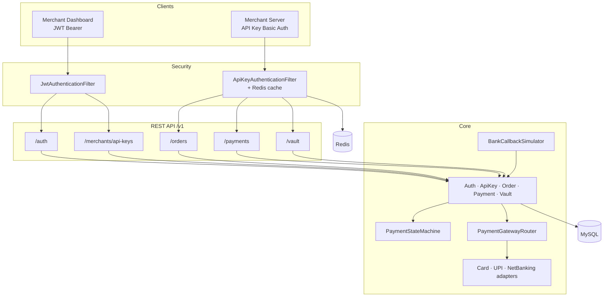
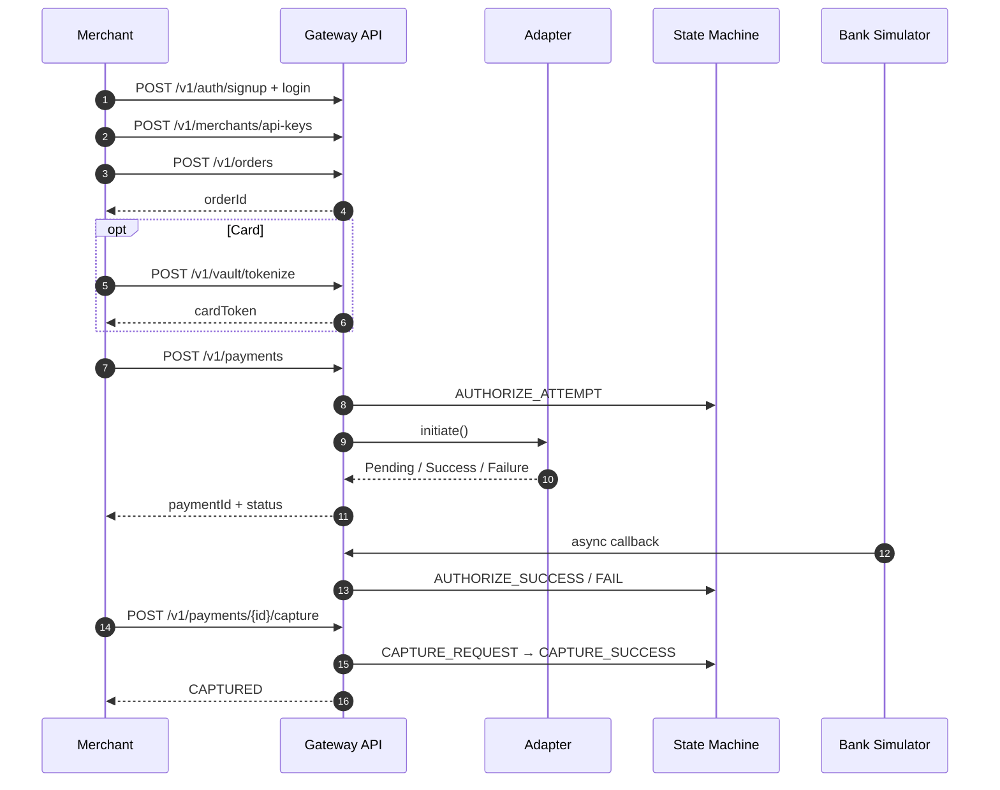
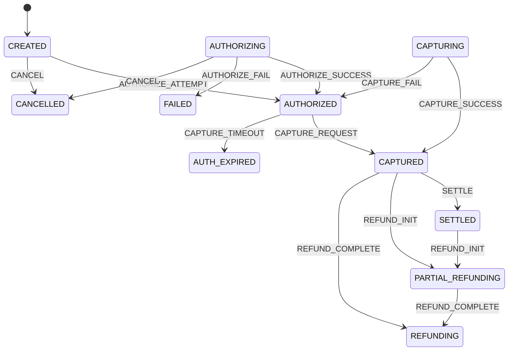

# Payment Gateway Backend

A Spring Boot payment gateway inspired by Razorpay. It provides merchant onboarding, dual authentication (JWT + API keys), order/payment lifecycle management, card tokenization, payment method routing, and a configurable bank callback simulator.

---

## Table of Contents

- [Features](#features)
- [Architecture](#architecture)
- [Tech Stack](#tech-stack)
- [Project Structure](#project-structure)
- [Getting Started](#getting-started)
- [Configuration](#configuration)
- [Authentication](#authentication)
- [API Reference](#api-reference)
- [Payment Flow](#payment-flow)
- [Payment State Machine](#payment-state-machine)
- [Roadmap](#roadmap)
- [Security Notes](#security-notes)
- [License](#license)

---

## Features

- **Merchant onboarding** — signup, login, and JWT-secured dashboard APIs
- **Server-to-server access** — API key create / list / revoke / rotate with HTTP Basic Auth
- **Redis-backed API key cache** — faster auth lookups on payment routes
- **Orders & payments** — create order, initiate payment, capture authorized funds
- **Multi-method routing** — Card, UPI, and Net Banking via strategy-based adapters
- **Card vault** — PAN tokenization with encrypted storage
- **Payment state machine** — strict transitions with audit logging
- **Bank simulator** — async callbacks with per-method delay, success rate, and chaos modes
- **Global exception handling** — consistent error responses across APIs

---

## Architecture


```mermaid
flowchart TB
    subgraph Clients
        Dashboard["Merchant Dashboard<br/>JWT Bearer"]
        MerchantServer["Merchant Server<br/>API Key Basic Auth"]
    end

    subgraph Security
        JWT["JwtAuthenticationFilter"]
        APIKEY["ApiKeyAuthenticationFilter<br/>+ Redis cache"]
    end

    subgraph API["REST API /v1"]
        Auth["/auth"]
        Keys["/merchants/api-keys"]
        Orders["/orders"]
        Payments["/payments"]
        Vault["/vault"]
    end

    subgraph Core
        Services["Auth · ApiKey · Order · Payment · Vault"]
        SM["PaymentStateMachine"]
        Router["PaymentGatewayRouter"]
        Adapters["Card · UPI · NetBanking adapters"]
        Sim["BankCallbackSimulator"]
    end

    DB[(MySQL)]
    Redis[(Redis)]

    Dashboard --> JWT --> Auth & Keys
    MerchantServer --> APIKEY --> Orders & Payments & Vault
    APIKEY --> Redis
    Auth & Keys & Orders & Payments & Vault --> Services
    Services --> SM & Router
    Router --> Adapters
    Sim --> Services
    Services --> DB
```

---

## Tech Stack

| Category | Technology |
|----------|------------|
| Language | Java 21 |
| Framework | Spring Boot 4.0.6 |
| Security | Spring Security, JWT (JJWT), API Key (Basic Auth) |
| Persistence | Spring Data JPA, Hibernate, MySQL 8 |
| Cache | Redis (`spring-boot-starter-data-redis`) |
| Mapping | MapStruct |
| Build | Maven |
| Utilities | Lombok, Bean Validation |

---

## Project Structure

```text
src/main/java/com/gayeway/Razorpay/
├── common/                 # Shared enums, base entities, exceptions, utils
├── merchant/               # Auth, API keys, JWT/API-key security, Redis cache
├── payment/                # Orders, payments, gateway adapters, state machine, simulator
├── vault/                  # Card tokenization & encryption
├── operations/             # Settlement, webhook, DLQ entities (APIs pending)
└── RazorpayApplication.java
```

---

## Getting Started

### Prerequisites

- Java 21+
- Maven 3.9+
- MySQL 8+
- Redis 6+ (for API key caching)

### 1. Create the database

```sql
CREATE DATABASE razorpayDB;
```

### 2. Configure the application

Edit `src/main/resources/application.yaml` (or prefer environment variables):

```yaml
spring:
  datasource:
    url: jdbc:mysql://localhost:3306/razorpayDB
    username: <your-db-user>
    password: <your-db-password>
  data:
    redis:
      host: ${REDIS_HOST:localhost}
      port: ${REDIS_PORT:6379}

jwt:
  secret-key: <strong-random-secret>

vault:
  masterkey: <strong-random-master-key>
```

### 3. Run

```bash
# Start Redis (example)
redis-server

# Run the app
./mvnw spring-boot:run
```

Server starts at **http://localhost:9090**

### 4. Build

```bash
./mvnw clean package
java -jar target/Razorpay-0.0.1-SNAPSHOT.jar
```

---

## Configuration

| Property | Default | Description |
|----------|---------|-------------|
| `server.port` | `9090` | HTTP port |
| `spring.datasource.*` | — | MySQL connection |
| `spring.data.redis.*` | `localhost:6379` | Redis for API key cache |
| `payment.order.default-order-expiry-minutes` | `30` | Order TTL |
| `payment.simulator.chaos-mode` | `NORMAL` | `NORMAL` / `SUCCESS` / `FAILURE` / `TIMEOUT` / `SLOW` |
| `payment.simulator.methods.*.success-rate` | varies | Per-method approval rate |
| `jwt.secret-key` | — | JWT signing secret |
| `vault.masterkey` | — | Card vault encryption master key |

---

## Authentication

Two independent security filter chains:

| Audience | Auth | Routes |
|----------|------|--------|
| Merchant dashboard | JWT Bearer | `/v1/auth/**`, `/v1/merchants/**` |
| Server-to-server | API Key (HTTP Basic) | `/v1/orders/**`, `/v1/payments/**`, `/v1/vault/**` |

**JWT**

1. `POST /v1/auth/signup`
2. `POST /v1/auth/login` → receive token
3. Call merchant APIs with `Authorization: Bearer <token>`

**API Key**

1. Create a key via `POST /v1/merchants/api-keys` (JWT required)
2. Call payment APIs with:

```http
Authorization: Basic base64(<keyId>:<secret>)
```

API key lookups are cached in Redis to reduce database hits on every request.

---

## API Reference

Base URL: `http://localhost:9090`

### Auth (public)

| Method | Endpoint | Description |
|--------|----------|-------------|
| `POST` | `/v1/auth/signup` | Register merchant |
| `POST` | `/v1/auth/login` | Login and get JWT |

### API Keys (JWT)

| Method | Endpoint | Description |
|--------|----------|-------------|
| `POST` | `/v1/merchants/api-keys` | Create API key |
| `GET` | `/v1/merchants/api-keys` | List keys |
| `DELETE` | `/v1/merchants/api-keys/{keyId}` | Revoke key |
| `POST` | `/v1/merchants/api-keys/{keyId}/rotate` | Rotate key |

### Orders (API Key)

| Method | Endpoint | Description |
|--------|----------|-------------|
| `POST` | `/v1/orders` | Create payment order |

### Payments (API Key)

| Method | Endpoint | Description |
|--------|----------|-------------|
| `POST` | `/v1/payments` | Initiate payment |
| `POST` | `/v1/payments/{paymentId}/capture` | Capture authorized payment |

### Vault (API Key)

| Method | Endpoint | Description |
|--------|----------|-------------|
| `POST` | `/v1/vault/tokenize` | Tokenize card PAN |

### Supported payment methods

| Method | Adapter | Status |
|--------|---------|--------|
| Card | `CardPaymentAdapter` | Implemented |
| UPI | `UpiPaymentAdapter` | Implemented |
| Net Banking | `NetBankingAdapter` | Implemented |
| Wallet | — | Enum only |

---

## Payment Flow


```mermaid
sequenceDiagram
    autonumber
    participant M as Merchant
    participant API as Gateway API
    participant GW as Adapter
    participant SM as State Machine
    participant Bank as Bank Simulator

    M->>API: POST /v1/auth/signup + login
    M->>API: POST /v1/merchants/api-keys
    M->>API: POST /v1/orders
    API-->>M: orderId

    opt Card
        M->>API: POST /v1/vault/tokenize
        API-->>M: cardToken
    end

    M->>API: POST /v1/payments
    API->>SM: AUTHORIZE_ATTEMPT
    API->>GW: initiate()
    GW-->>API: Pending / Success / Failure
    API-->>M: paymentId + status

    Bank->>API: async callback
    API->>SM: AUTHORIZE_SUCCESS / FAIL

    M->>API: POST /v1/payments/{id}/capture
    API->>SM: CAPTURE_REQUEST → CAPTURE_SUCCESS
    API-->>M: CAPTURED
```

---

## Payment State Machine

Invalid transitions throw `InvalidStateTransitionException`. Every transition is written to `payment_transition_log`.


```mermaid
stateDiagram-v2
    [*] --> CREATED
    CREATED --> AUTHORIZED: AUTHORIZE_ATTEMPT
    CREATED --> CANCELLED: CANCEL
    AUTHORIZING --> AUTHORIZED: AUTHORIZE_SUCCESS
    AUTHORIZING --> FAILED: AUTHORIZE_FAIL
    AUTHORIZING --> CANCELLED: CANCEL
    AUTHORIZED --> CAPTURED: CAPTURE_REQUEST
    AUTHORIZED --> AUTH_EXPIRED: CAPTURE_TIMEOUT
    CAPTURING --> CAPTURED: CAPTURE_SUCCESS
    CAPTURING --> AUTHORIZED: CAPTURE_FAIL
    CAPTURED --> SETTLED: SETTLE
    CAPTURED --> PARTIAL_REFUNDING: REFUND_INIT
    CAPTURED --> REFUNDING: REFUND_COMPLETE
    SETTLED --> PARTIAL_REFUNDING: REFUND_INIT
    PARTIAL_REFUNDING --> REFUNDING: REFUND_COMPLETE
```

---

## Roadmap

- [x] Domain model & global exception handling
- [x] Merchant signup / login (JWT)
- [x] API key lifecycle + Redis cache
- [x] Orders, payments, capture
- [x] Gateway adapters (Card / UPI / Net Banking)
- [x] Payment state machine + transition audit
- [x] Card vault tokenization
- [x] Bank callback simulator
- [ ] Refund APIs
- [ ] Settlement batch processing
- [ ] Webhook delivery & DLQ retry
- [ ] Wallet payment adapter
- [ ] Admin APIs (`/v1/admin/**`)

---

## Security Notes

- Do **not** commit real DB passwords, JWT secrets, or vault master keys.
- Prefer environment variables for secrets in any shared or production-like setup.
- API key secrets are hashed; plaintext secret is returned only at create/rotate time.
- This project is for learning — not PCI-DSS certified for real card data.

